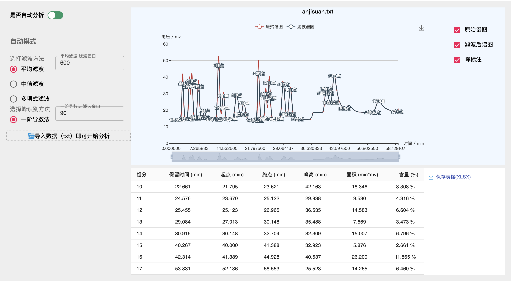
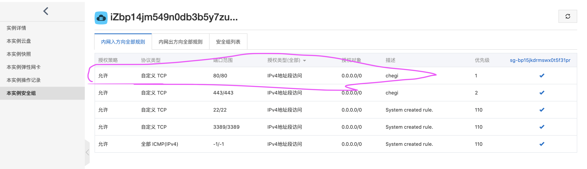

## 基于 React web 的色谱分析软件 (东南大学仪科学院毕设项目)
### 🍇算法流程分为：

>滤波(移动平均滤波)

>-> 

>峰识别(一阶导数法，宽松条件判断色谱波形和导数波形的单增单减) 

>-> 

>重叠峰分解（垂线法）

>->

>定性定量分析(峰面积、各组分含量)



### 🍑 使用：

首先确保机器安装了 node.js

git clone 本仓库到本地后：

1. 开启服务，分为前端网页服务和后端文件数据处理服务：
>开启本地网页服务,在项目根目录执行 `npm start`，然后打开 `localhost:3000` ,可以看到前度网页，色谱文件的上传，谱图绘制，分析结果都会通过这个页面展示。
>开启后端服务, 执行 `npm run server`，server 可以提供后端文件数据序列化、下载 xlsx 文件的功能

2. 进入文件夹 `原始数据`, 里面有色谱原始 txt 格式文件，在网页中打开，后端即可序列化这个 txt 文件，将其转化为 json 文件，再传回给前端，前端会将色谱绘制出来，依次点击 `滤波`、`峰检测即可`，前端会开启线程分析色谱，点击保存分析结果，可以下载 xlsx 格式的色谱分析结果。

3. 提供了色谱绘制和分析结果整理成表单，可以下载表单供分析。

### 🚣🏼‍♀️软件测试
使用 supertest 和 Mocha 进行接口测试
执行 `npm run test` ，获得测试报告

### 🧀 亮点

1. 使用 node 流(自动模式)和 JS 的 worker 功能(手动模式)，无阻塞高效执行色谱算法。

2. 没有使用数据库服务，纯靠文件的读写，避免服务端数据库I/O，而是在读取流的同时就进行数据运算，减少中间不必要的数据I/O。

3. 使用服务器提供 txt 文件数据序列化和分析结果以 xlsx 文件下载功能。这样的前后端模式可以非常方便的移植到 Electron 桌面端（node 进程和 chroimium 渲染进程）。

### ⛳️ 项目移植

- [web 端](https://github.com/qumuchegi/web-chromatography-analysis)

- [Android/ios 端（React Native）](https://github.com/qumuchegi/RN_chromatography_software-)

## 🪂计划新增

- [x] 新的软件架构：app 端接收用户上传的 txt 文件和用户选择的滤波和峰识别算法，后端接收到文件和用户选择的算法后，再使用 Node 的流读取文件并同时进行滤波和峰识别的处理，而不用中间生成 json 文件再进行滤波和峰识别。这种方法使用了软件的并行原理（有别于并发），即将一个大任务分成很多小任务，小任务之间不是同时进行的，但是每一个小任务只给一小段时间执行，原来滤波和峰识别的两个大任务就会被分成小任务，总体看起来就是两种任务同时进行。
- [x] 自动识别功能下，使用流模式处理算法后得到的峰比同条件下更少，需要检查一下流的对接这一步.这个已经解决，解决方法是保留上一次为识别完的峰的特殊点，下一段识别可以在最后一个特殊点之后识别下有一个特殊点。

## ☄️部署

1. 连接阿里云服务器 ：
```shell
ssh root@XXXX.XXX.XXX.XX
```
2. 在服务器上安装 node.js, 注意这里一定要选择带有 linux 的版本，因为服务器是Linux系的 ：
```shell
wget https://nodejs.org/dist/v12.16.3/node-v12.16.3-linux-x64.tar.xz
```
3. 解压 node.js, 并将解压后的 nodejs 文件夹放到 `/usr/local/nodejs` ：

```shell
tar -xvf node-v12.16.3-linux-x64.tar.xz
```
4. 关联 node/npm 命令：
```shell
ln -s /usr/local/nodejs/node-v12.16.3-linux-x64/bin/npm /usr/bin/node

ln -s /usr/local/nodejs/node-v12.16.3-linux-x64/bin/npm /usr/bin/npm
```
验证:
```shell
node -v
v12.16.3

npm -v
6.14.4

```
安装成功！

5. 将本地服务部署到服务器:

```shell
scp server -r root@xxx.xxx.xx.xx:server
```

6. 使用 npm 安装 `pm2` ，用 `pm2` 启动服务:
```shell
npm install -g pm2
```
全局注册 pm2 的命令，否则将找不到 pm2 的命令
```shell
ln -s /usr/local/nodejs/node-v12.16.3-linux-x64/lib/node_modules/pm2/bin/pm2 /usr/local/bin
```
7. 下载服务服务端脚本中的所有依赖，比如 express、multer、cors等, `npm i --save express cors body-parser ....`

8. 添加云服务器安全组规则，如下:



9. 对于 `server/app.js` 的一些修改：
在本地开发中，app.js 监听 localhost 即 127.0.0.1 ，port 为 3001, 获取网页我们是用create-react-app 提供的本地服务器，但是传到远程服务器后，要做以下修改：

>（1）在 `server/app.js` 中修改监听的 host 为 `0.0.0.0`, port 为 `80`，在域名注册的地方（我是在腾讯注册的域名）绑定阿里云服务器的主机，我绑定的是`sepu.chegiblog.xyz`这个域名，所以访问`http://sepu.chegiblog.xyz`才能正常访问到阿里云服务。
 
>（2）将 react 前端页面打包在 build 目录，然后移动到 `server/dist` 目录，然后在 `server/app.js` 中对外提供静态服务，这样就能访问到 `server/dist/build` 里面的静态页面了，注意前端页面访问服务 API 就要从 `http://localhost:80` 改为 `http://sepu.chegiblog.xyz:80`

```js
app.use(express.static('server/dist/build'))
```

10. 最后使用 pm2 启动服务: `pm2 start server/app.js`, 访问`http://sepu.chegiblog.xyz`即可正常访问到阿里云服务了

11. 后面还涉及网站备案，只要在阿里云控制台备案即可。如果不想备案，就直接使用ip地址，不用域名也可。